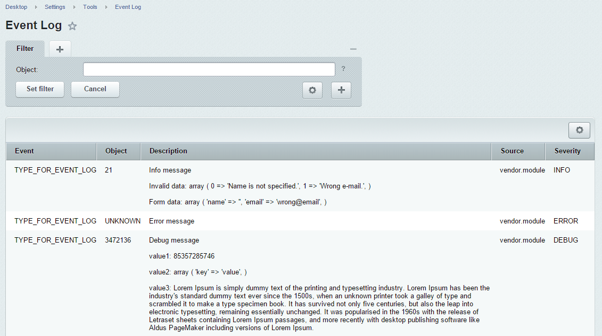

# Monolog adapter for Bitrix CMS

[](https://travis-ci.org/bitrix-expert/monolog-adapter)
[](https://packagist.org/packages/bitrix-expert/monolog-adapter) 
[](https://packagist.org/packages/bitrix-expert/monolog-adapter) 
[](https://packagist.org/packages/bitrix-expert/monolog-adapter)

[Monolog](https://github.com/Seldaek/monolog) adapter for Bitrix CMS:

* Bitrix handler and formatter for Monolog.
* Handler for logger uncaught exceptions of the Bitrix.
* Configuration loggers with using the `.settings.php`.

## Installation

```bash
composer require bitrix-expert/monolog-adapter
```

## Usage

### Configuring your loggers

Configurate the logger in the `.settings.php`:

```php
return array(
    'exception_handling' => array(
        'value' => array(
            'log' => array(
                'class_name' => '\Bex\Monolog\ExceptionHandlerLog',
                'settings' => array(
                    'logger' => 'app',
                ),
            ),
        ),
        'readonly' => false
    ),
    'monolog' => array(
        'value' => array(
            'handlers' => array(
                'default' => array(
                    'class' => '\Monolog\Handler\StreamHandler',
                    'level' => 'DEBUG',
                    'stream' => '/path/to/logs/app.log'
                ),
                'event_log' => array(
                    'class' => '\Bex\Monolog\Handler\BitrixHandler',
                    'level' => 'INFO',
                    'event' => 'FEEDBACK_NEW_MESSAGE',
                    'module' => 'vendor.module'
                ),
            ),
            'loggers' => array(
                'app' => array(
                    'handlers'=> array('default'),
                ),
                'feedback' => array(
                    'handlers'=> array('event_log'),
                )
            )
        ),
        'readonly' => false
    )
);
```

### Write logs

Write logs from your application. For example, write logs when created new message from the feedback form:

```php
<?php

use Monolog\Registry;

$logger = Registry::getInstance('feedback');

// Write info message with context: invalid message from feedback
$logger->info('Failed create new message on feedback form', [
    'item_id' => 21,
    'Invalid data' => $addResult->getErrorMessages(), // error savings
    'Form data' => $formRequest // data from feedback form
]);
```

The result in the Control Panel of Bitrix:



## Requirements

* PHP >= 5.3
* Bitrix CMS >= 15.0.2